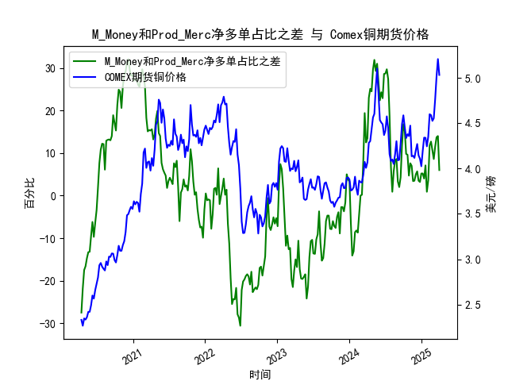

|            |   M_Money净多单占比 |   Prod_MercM_Money净多单占比 |   Comex铜期货价格 |   M_Money和Prod_Merc净多单占比之差 |
|:-----------|--------------------:|-----------------------------:|------------------:|-----------------------------------:|
| 2020-08-25 |                30.4 |                         43.5 |            2.934  |                               13.1 |
| 2020-08-18 |                30.1 |                         43   |            2.975  |                               12.9 |
| 2020-08-11 |                33.3 |                         39.4 |            2.8755 |                                6.1 |
| 2020-08-04 |                29.8 |                         41.9 |            2.8945 |                               12.1 |
| 2020-07-28 |                30.1 |                         42.3 |            2.9175 |                               12.2 |
| 2020-07-21 |                31.3 |                         42.1 |            2.958  |                               10.8 |
| 2020-07-14 |                32.7 |                         40.3 |            2.9325 |                                7.6 |
| 2020-07-07 |                35.5 |                         37.4 |            2.797  |                                1.9 |
| 2020-06-30 |                38.8 |                         35.4 |            2.7285 |                               -3.4 |
| 2020-06-23 |                39.9 |                         33.5 |            2.6585 |                               -6.4 |
| 2020-06-16 |                41.3 |                         31.6 |            2.5645 |                               -9.7 |
| 2020-06-09 |                39.7 |                         33.5 |            2.599  |                               -6.2 |
| 2020-06-02 |                40.3 |                         30.8 |            2.491  |                               -9.5 |
| 2020-05-26 |                41.9 |                         28.7 |            2.4185 |                              -13.2 |
| 2020-05-19 |                43.3 |                         30   |            2.418  |                              -13.3 |
| 2020-05-12 |                43.3 |                         28.6 |            2.359  |                              -14.7 |
| 2020-05-05 |                44.9 |                         28.3 |            2.3325 |                              -16.6 |
| 2020-04-28 |                45.6 |                         28.1 |            2.3455 |                              -17.5 |
| 2020-04-21 |                47.3 |                         25.5 |            2.2645 |                              -21.8 |
| 2020-04-14 |                49.2 |                         21.7 |            2.3295 |                              -27.5 |

### 1. M_Money与Prod_Merc净多单占比之差与Comex铜价的相关性及影响逻辑

#### **相关性分析**  
通过数据对比可以发现，**非商业持仓（M_Money，如对冲基金）与商业持仓（Prod_Merc，如生产商）的净多单占比之差与铜价呈现显著正相关**。具体表现为：  
- **差值扩大（非商业多头占比显著高于商业多头）**时，铜价往往处于上涨周期（例如差值达到30%以上时，铜价突破4.5美元/磅）。  
- **差值缩小或转为负值（商业空头占比上升）**时，铜价通常回调或下跌（例如差值为负且低于-20%时，铜价回落至3美元以下）。

#### **影响逻辑**  
1. **非商业持仓（投机资金）主导短期价格波动**：  
   - 对冲基金等机构倾向于追涨杀跌，在铜价上涨时加仓多单，放大市场波动。例如，在2020年铜价突破4美元后，非商业净多单占比快速攀升至30%以上，推动铜价加速上涨。  
   - 其交易行为受宏观经济预期（如通胀、美元指数）和资金流动性影响显著。

2. **商业持仓（产业资本）反映长期供需基本面**：  
   - 生产商和贸易商通过期货市场对冲价格风险。当商业净多单占比下降（或空头占比上升）时，往往预示产业端对高价铜的抵触（如减产、去库存），铜价可能见顶。  
   - 例如，2021年铜价创历史新高（接近5美元/磅）期间，商业空头持仓占比持续增加，最终引发价格回调。

3. **两者差值作为市场情绪指标**：  
   - 当差值达到极端值时（如非商业净多占比超过30%或商业净空占比超过20%），通常标志市场情绪过热或过度悲观，可能触发价格反转。

---

### 2. 近期投资或套利机会及策略

#### **当前数据信号**  
- **持仓结构分化**：近期差值从低位反弹（如从-20%回升至10%以上），但尚未进入极端区间，表明投机资金开始布局但未形成一致性看涨预期。  
- **铜价走势**：价格在4-4.5美元/磅区间震荡，未突破前高，反映多空博弈加剧。

#### **策略建议**  
1. **趋势跟踪策略**：  
   - **多头机会**：若差值持续扩大且铜价站稳4.3美元/磅（关键支撑位），可跟随非商业资金布局多单，目标价4.8-5美元。  
   - **空头机会**：若差值回落至0%以下且铜价跌破4美元，可结合库存回升或美元走强信号做空。

2. **均值回归套利**：  
   - **跨期套利**：当近月合约溢价（Backwardation）过高时（如价差超过5%），做空近月、做多远月，利用价差收敛获利。  
   - **跨市场套利**：若LME铜价与Comex铜价价差超过历史均值（约0.2美元/磅），可进行跨市场对冲。

3. **事件驱动策略**：  
   - 关注美联储政策转向（降息预期）或中国基建刺激政策，若差值快速跳升且铜价突破关键阻力位，可短线追多。

#### **风险提示**  
- **持仓数据的滞后性**：CFTC报告为周频数据，需结合实时价格和新闻验证。  
- **宏观扰动**：全球经济衰退风险或地缘冲突可能打破相关性逻辑（如2022年俄乌冲突导致铜价与持仓背离）。  
- **产业端超预期行为**：若商业空头因供应链问题被迫平仓（如矿山罢工），可能引发空头回补行情。
