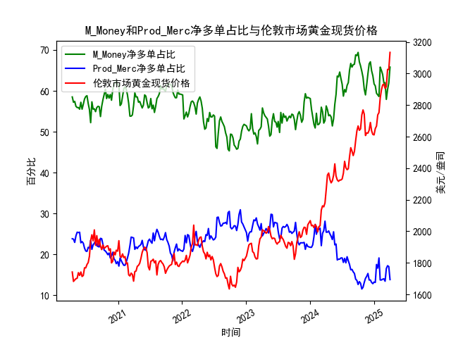

|            |   M_Money净多单占比 |   Prod_MercM_Money净多单占比 |   伦敦市场黄金现货价格 |   M_Money和Prod_Merc净多单占比之差 |
|:-----------|--------------------:|-----------------------------:|-----------------------:|-----------------------------------:|
| 2024-11-19 |                61.5 |                         14.6 |                2623.2  |                               46.9 |
| 2024-11-26 |                64.2 |                         15.3 |                2622.1  |                               48.9 |
| 2024-12-03 |                66.6 |                         13.7 |                2640.65 |                               52.9 |
| 2024-12-10 |                67.1 |                         13.7 |                2689.6  |                               53.4 |
| 2024-12-17 |                64.9 |                         13.1 |                2636.35 |                               51.8 |
| 2024-12-24 |                63.7 |                         12.8 |                2613.75 |                               50.9 |
| 2024-12-31 |                61.7 |                         13.2 |                2610.85 |                               48.5 |
| 2025-01-07 |                61.2 |                         13.1 |                2650.85 |                               48.1 |
| 2025-01-14 |                59.4 |                         17.5 |                2667    |                               41.9 |
| 2025-01-21 |                59   |                         16.6 |                2737.8  |                               42.4 |
| 2025-01-28 |                58.6 |                         19.1 |                2751.9  |                               39.5 |
| 2025-02-04 |                65.8 |                         13.7 |                2843.55 |                               52.1 |
| 2025-02-11 |                65   |                         13.7 |                2895.4  |                               51.3 |
| 2025-02-18 |                64   |                         13.9 |                2927.1  |                               50.1 |
| 2025-02-25 |                61.9 |                         14   |                2933.25 |                               47.9 |
| 2025-03-04 |                62   |                         13.4 |                2905.9  |                               48.6 |
| 2025-03-11 |                57.9 |                         16.5 |                2916.9  |                               41.4 |
| 2025-03-18 |                60.3 |                         17.2 |                3025.8  |                               43.1 |
| 2025-03-25 |                61.9 |                         17   |                3025.2  |                               44.9 |
| 2025-04-01 |                65.8 |                         13.8 |                3133.7  |                               52   |

### 1. M_Money与Prod_Merc净多单占比之差与黄金价格的相关性及逻辑

#### 相关性分析：
- **正向关联性**：非商业持仓（M_Money，通常为投机资金）的净多单占比与商业持仓（Prod_Merc，多为套保资金）的净多单占比之差，通常与黄金价格呈现**阶段性正相关**。当差值扩大时（投机多头占比显著高于商业多头），黄金价格倾向于上涨；差值缩小时（投机资金撤离或商业套保增加），价格可能承压。
- **极端值反转信号**：当差值达到历史高位（如数据中的56.8、54.9）时，往往伴随金价短期见顶（如2020年8月金价创历史新高后回调）；反之，极低差值（如16.9、14.8）可能预示价格触底反弹。

#### 影响逻辑：
- **投机资金驱动短期波动**：非商业持仓代表投机资金对市场情绪的放大作用。当市场看涨黄金时，投机资金快速涌入推高价格，但持仓占比过高后易引发获利了结。
- **商业持仓反映长期供需**：商业机构（如矿产商、珠宝商）的套保行为与实物供需更相关。当差值扩大（商业多头占比下降），可能暗示实物需求疲软或供应增加，最终抑制金价。
- **背离信号**：若黄金价格上涨但差值未同步扩大（如数据末期金价冲高至3133美元，差值为52），可能反映投机情绪与价格走势的背离，需警惕回调风险。

---

### 2. 近期投资或套利机会与策略

#### 当前市场观察：
- **持仓差值特征**：近期差值从高位（56.8）回落至52，但仍处于历史较高水平，表明投机情绪尚未完全退潮，但商业套保可能逐步增加。
- **价格表现**：金价在创出3133美元高点后波动加剧，显示多空博弈激烈。

#### 潜在机会：
1. **趋势跟踪策略**：
   - **多头谨慎持有**：若差值维持在40以上且金价站稳3000美元，短期趋势或延续，但需严格止损（如跌破2900美元）。
   - **空头信号触发**：若差值快速回落至40以下且金价跌破关键支撑（如2850美元），可布局空单。

2. **均值回归套利**：
   - **跨期套利**：近期差值处于高位，而历史均值约35-40，可做空近期合约、做多远月合约，押注差值收敛。
   - **期现套利**：若期货溢价（Contango）显著扩大（反映市场情绪过热），可卖出期货、买入现货锁定价差。

3. **事件驱动策略**：
   - **关注美联储政策与通胀数据**：若加息预期升温导致差值快速收缩，可提前布局黄金空头；若地缘风险升级推动差值再度扩大，可追多。

#### 风险提示：
- **极端波动风险**：当前持仓差值仍处高位，价格对消息敏感，需防范突发回调。
- **流动性风险**：市场情绪切换时，黄金期货价差可能短期扭曲，套利需控制仓位。

---

### 总结：
持仓差值与黄金价格的阶段性正相关性为趋势交易提供依据，而极端值和背离信号是反转策略的关键。当前市场需警惕投机情绪降温带来的回调压力，建议结合技术面（如支撑/阻力位）与宏观事件（如美联储政策）动态调整策略。
