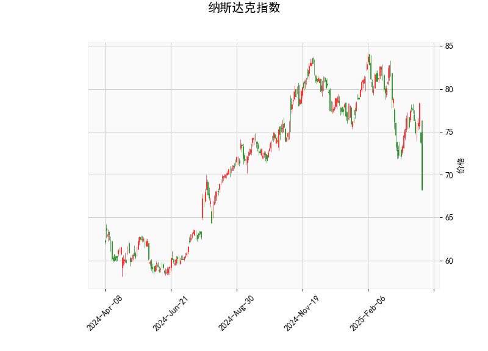

# 纳斯达克指数技术分析及策略建议

## 一、技术分析结果解读

### 1. 核心指标表现
- **RSI（26.14）**：已显著低于30超卖阈值，暗示市场短期可能出现超卖反弹。
- **MACD（-0.639）vs 信号线（-0.642）**：MACD线首次上穿信号线（金叉雏形），柱状图转正（0.0029），显示下跌动能衰减。
- **布林带**：
  - 当前价（101.95）紧贴下轨（101.98），距离中轨（106.16）有4.2%空间
  - 轨道宽度（上轨110.34-下轨101.98=8.36）处于收缩状态
- **K线形态**：出现「CDL3OUTSIDE」看涨吞噬形态，需验证有效性。

### 2. 多空信号矛盾点
- **多头支撑**：RSI超卖+布林带下轨支撑+MACD潜在金叉，构成技术性反弹逻辑。
- **空头压制**：价格仍处中轨下方，MACD绝对值为负值，整体趋势尚未反转。

---

## 二、潜在机会与策略

### 1. 短期超跌反弹机会
**策略逻辑**：
- 结合RSI超卖+下轨支撑，可尝试轻仓博弈反弹
- 目标位：中轨106.16（约4%上行空间）
- 止损位：下轨下方1%（约100.95）

**操作建议**：
- 突破102.5（脱离下轨粘连区）后建仓
- 若MACD柱状图连续3根放大，可加仓

### 2. 中期反转确认机会
**验证条件**：
- 需满足以下两项：
  1. 周线收盘站上中轨106.16
  2. MACD柱状图持续扩张且RSI回升至45以上

**策略设计**：
- 突破中轨后回踩确认时建仓
- 第二目标看向上轨110.34（约8%空间）

### 3. 波动率套利机会
**背景依据**：
- 布林带宽度收缩至近一年最低10%分位数（隐含波动率下降）
- 美联储议息会议等事件可能引发波动率跳升

**期权策略**：
- 买入跨式组合（Long Straddle）：
  - 执行价102，到期日1个月
  - 盈亏平衡点：±3.5%波动
- 卖出蝶式价差（Short Butterfly）：
  - 行权价98/102/106组合
  - 赚取波动率回归溢价

---

## 三、风险警示
1. **假突破风险**：CDL3OUTSIDE形态需次日收盘确认，当前成交量未同步放大
2. **宏观压制**：10年期美债收益率若突破4.5%，可能压制科技股估值
3. **资金流向**：需监控VIX恐慌指数（高于25则反弹持续性存疑）

> 注：以上分析基于历史数据，实际交易需结合实时市场动态和基本面事件（如财报季、地缘政治等）综合判断。建议仓位控制在总资金5%以内，严格执行止损纪律。