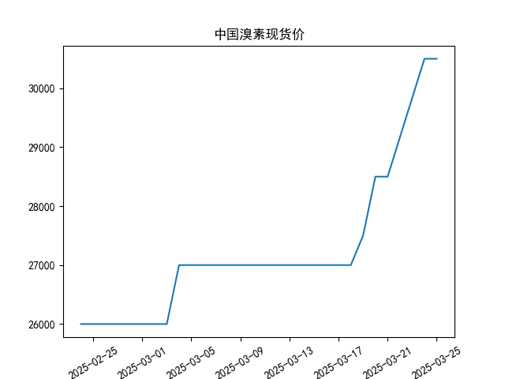

### 近期中国溴素现货价分析及投资/套利机会

#### 1. **价格趋势分析**
- **稳定期（2月24日-3月3日）**：价格稳定在26,000元/吨，市场供需平衡，无明显波动。
- **首次上涨（3月4日-3月18日）**：价格跳涨至27,000元/吨并维持两周，可能由短期供需失衡（如生产端收缩或需求端补库）驱动。
- **加速上涨（3月19日-3月25日）**：价格从27,500元/吨快速攀升至30,500元/吨，涨幅达10.7%，显示市场情绪转向乐观或存在突发性供应短缺。

#### 2. **潜在投资机会**
- **趋势跟踪策略**：
  - **做多机会**：3月中下旬价格加速上涨，可考虑短期多头头寸，目标价参考30,500元/吨以上，但需警惕高位回调风险。
  - **回调买入**：若价格回落至28,000-29,000元/吨区间（前期支撑位），可视为二次入场机会。

- **套利策略**：
  - **跨期套利**：若期货市场存在远月合约溢价（Contango），可买入现货并卖出远月合约，锁定价差收益。
  - **区域套利**：关注国内外价差（如中东、欧洲溴素价格），若国内价格显著高于国际市场，可尝试进口套利（需考虑关税、物流成本）。

- **库存策略**：
  - 贸易商可逢低囤货（如26,000-27,000元/吨区间），待价格上涨至30,000元/吨以上逐步出货，赚取价差。

#### 3. **风险因素**
- **供应恢复风险**：若价格上涨由短期停产或运输中断导致，需警惕供应恢复后价格快速回落。
- **需求端变化**：溴素下游（阻燃剂、医药等）需求若不及预期，可能压制价格上行空间。
- **政策风险**：环保政策收紧可能推高生产成本，反之放松则可能增加供应。

#### 4. **操作建议**
- **短期（1-2周）**：关注30,500元/吨阻力位，若突破可持有或加仓；若滞涨则止盈。
- **中期（1个月）**：跟踪行业库存数据及下游需求，若库存持续低位且需求旺盛，可维持多头策略。
- **对冲策略**：持有现货的投资者可通过卖出期货合约对冲价格下跌风险。

#### 5. **结论**
近期溴素价格呈现明显上涨趋势，短期存在做多和套利机会，但需密切关注供需变化及政策动向，灵活调整仓位并严格设置止损（如跌破28,000元/吨）。

|            |   中国溴素现货价 |
|:-----------|-----------------:|
| 2025-02-24 |            26000 |
| 2025-02-25 |            26000 |
| 2025-02-26 |            26000 |
| 2025-02-27 |            26000 |
| 2025-02-28 |            26000 |
| 2025-03-03 |            26000 |
| 2025-03-04 |            27000 |
| 2025-03-05 |            27000 |
| 2025-03-06 |            27000 |
| 2025-03-07 |            27000 |
| 2025-03-10 |            27000 |
| 2025-03-11 |            27000 |
| 2025-03-12 |            27000 |
| 2025-03-13 |            27000 |
| 2025-03-14 |            27000 |
| 2025-03-17 |            27000 |
| 2025-03-18 |            27000 |
| 2025-03-19 |            27500 |
| 2025-03-20 |            28500 |
| 2025-03-21 |            28500 |
| 2025-03-24 |            30500 |
| 2025-03-25 |            30500 |