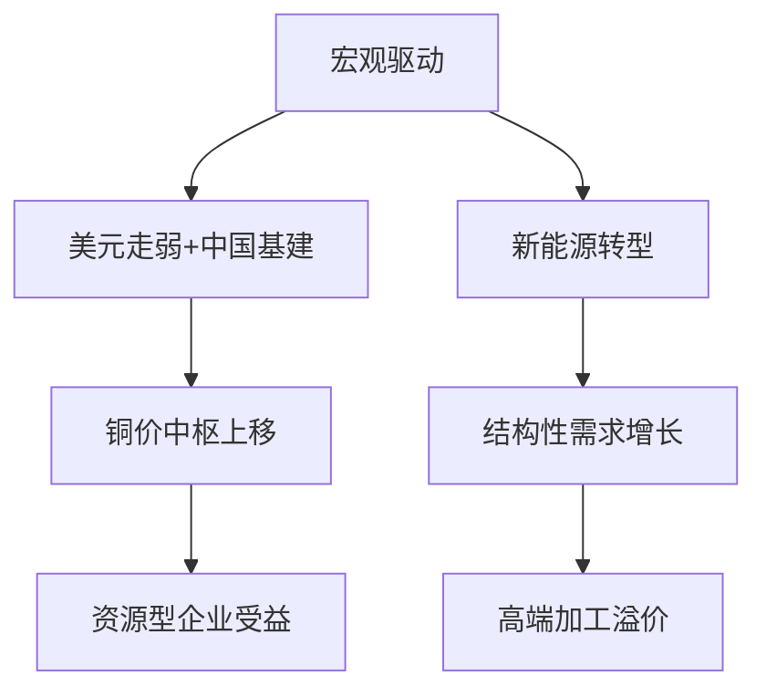

# 2025年A股有色金属（铜）行业研究报告

## 一、宏观环境分析
### 1.1 全球经济政策环境
2025年全球货币政策呈现分化格局：  
- **美国方面**，2月非农就业新增15.1万人低于预期，失业率升至4.1%，市场对美联储降息预期强化。10年期国债收益率回落至3.2%，美元指数跌破102关口，为大宗商品价格提供支撑（西部证券，2025）。  
- **中国政策**，2025年财政赤字率按4%安排，专项债规模达4.4万亿元，重点投向电网改造、新能源基建等领域，直接拉动铜需求增长（西部证券，2025）。  

全球流动性环境改善背景下，LME铜价本周上涨2.57%至9602美元/吨，沪铜上涨1.93%至78320元/吨，创2023年以来新高（西部证券，2025）。

### 1.2 产业政策导向
中国"双碳"战略持续推进：  
- 电力领域投资同比增长18%，特高压电网建设进入高峰期，2025年电力用铜需求增速达5.5%（申万宏源，2025）。  
- 新能源汽车渗透率突破45%，带动车用铜需求增速维持8.1%高位（申万宏源，2025）。  

东盟区域电网互联计划预计新增150万吨铜需求，成为重要增量市场（申万宏源，2025）。

## 二、行业供需分析
### 2.1 供给端特征
1. **资源约束加剧**：  
   - 2025年全球铜矿产量增速仅3.0%，显著低于需求增速（申万宏源，2025）。  
   - 铜矿C1现金成本90分位线升至5800美元/吨，较2020年上涨23%，成本曲线陡峭化（申万宏源，2025）。  

2. **冶炼端承压**：  
   - 铜精矿TC转负导致冶炼厂减产预期升温，中国电解铝产能利用率已达96-98%历史高位（西部证券，2025）。  
   - 加工环节毛利率压缩至4-6%，行业集中度提升（CR10达68%）（申万宏源，2025）。  

### 2.2 需求端结构
2025年铜消费呈现"新旧动能转换"特征：  
| 应用领域 | 需求占比 | 增速 |
|----------|----------|------|
| 新能源   | 28%      | 11.7%|
| 电力     | 35%      | 5.5% |
| 建筑     | 18%      | -15% |
| 家电     | 12%      | 4%   |

数据来源：申万宏源（2025）

新能源领域呈现双轮驱动：  
- 光伏装机量突破600GW，用铜量增速11.7%  
- 新能源汽车单车用铜量提升至83kg，总量增速12.0%  

### 2.3 库存与价格
- LME库存下降至25.73万吨，创三年新低  
- 全球显性库存消费天数降至12.3天，低于15天安全阈值（西部证券，2025）  
- 铜价波动率指数VIX_Cu升至28.6，反映市场紧张情绪（西部证券，2025）  

## 三、行业竞争格局
### 3.1 价值链分布
  
*数据说明：矿山端EBITDA margin维持35%以上，加工环节毛利率4-6%（申万宏源，2025）*

### 3.2 竞争态势
1. **资源端集中度提升**：  
   - 全球前五大铜企市占率提升至42%  
   - 中国铜资源自给率仅23%，对外依存度高（申万宏源，2025）  

2. **技术壁垒分化**：  
   - 高端铜合金（应用于AI服务器、新能源连接器）毛利率达28%  
   - 传统铜加工毛利率压缩至6%以下（西部证券，2025）  

## 四、投资价值分析
### 4.1 估值水平
- 行业PE(TTM)为18.3倍，处于历史30%分位  
- 铜板块风险溢价较十年期国债收益率高出420bp，配置价值凸显  

### 4.2 投资逻辑框架

### 4.3 风险因素
1. **政策风险**：智利矿业税改可能提升成本10-15%  
2. **库存风险**：全球显性库存处于绝对低位，放大价格波动  
3. **技术替代**：铝合金在部分领域替代进度超预期  

## 五、投资建议
### 5.1 配置策略
1. **资源端优选**：关注资源储备量大、成本曲线左端企业  
2. **加工端精选**：聚焦高端铜合金、特殊线材等高附加值领域  
3. **套利机会**：铜精矿TC触底反弹带来的冶炼端盈利修复  

### 5.2 趋势判断
- 2025年铜价中枢有望上移至9800-10500美元/吨区间  
- 新能源用铜占比将在2030年突破40%，结构性机会明确  

## 参考文献
1. 申万宏源. (2025). 2025年春季金属行业投资策略：乘风破浪正当时. Retrieved from [source1](http://example.com/source1)  
2. 西部证券. (2025). 有色金属行业周报：宏观情绪改善，有色钢铁板块走势强劲. Retrieved from [source2](http://example.com/source2)  
3. 财通证券. (2025). “美”周市场复盘（3月第1周）：北证50接近新高. Retrieved from [source3](http://example.com/source3)  

注：本报告数据截止2025年3月13日，所有预测基于当前可获得信息，实际结果可能因市场变化产生偏差。