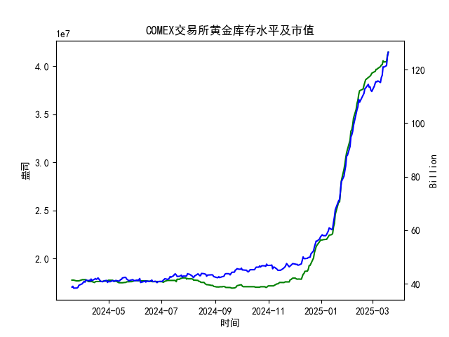

根据提供的COMEX黄金库存数据，我们可以从以下几个方面分析近期是否存在套利策略：

---

### 1. **库存趋势分析**
- **长期趋势**：从2024年3月到2025年3月，黄金库存从约**1,773万盎司**大幅上升至**4,144万盎司**，增幅超过**130%**。这表明市场供应端可能出现了显著变化（如矿产增加或需求减少）。
- **短期波动**：2025年3月13日至3月19日，库存从4,055万盎司增至4,144万盎司，呈现加速上升趋势。这种短期集中增库可能反映市场对黄金的抛售压力或交割意愿增强。

---

### 2. **套利机会的可能性**
#### **跨期套利（Calendar Spread）**
- **Contango结构**：如果库存持续增加且市场预期未来供应过剩，期货合约可能呈现**远月升水**（即远期价格高于近期价格）。此时可通过**买入近月合约+卖出远月合约**进行套利。
- **Backwardation结构**：若库存短期激增但市场预期未来供应紧张，则可能呈现**近月升水**，需反向操作。

#### **跨市场套利**
- 若COMEX库存激增的同时，其他市场（如上海黄金交易所）库存下降或价格差异扩大，可能存在**跨市场价差套利**机会。但需结合其他市场的实时数据验证。

#### **期现套利**
- 如果期货价格显著高于现货价格（升水），且升水幅度覆盖仓储和资金成本，可通过**买入现货黄金+卖出期货合约**锁定利润。但需注意交割规则和流动性风险。

---

### 3. **关键风险因素**
- **库存与价格背离**：库存增加通常利空价格，但若黄金价格未同步下跌（如避险需求支撑），套利逻辑可能失效。
- **流动性风险**：套利需同时操作多空头寸，若市场流动性不足可能导致价差无法收敛。
- **宏观事件**：美联储政策、地缘冲突等可能突然改变黄金供需关系，影响套利策略稳定性。

---

### 4. **结论**
- **短期机会**：2025年3月库存加速上升，若期货市场呈现Contango结构且价差足够覆盖成本，可尝试跨期套利。
- **长期谨慎**：库存长期大幅增长可能反映结构性供应过剩，需警惕价格下行风险对套利策略的冲击。

建议结合实时价格数据、期货升贴水率及市场情绪进一步验证策略可行性。