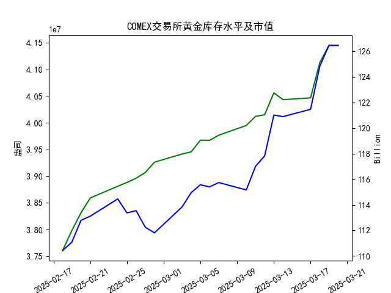

根据提供的数据，近期黄金市场存在潜在的跨市套利机会，具体分析如下：

---

### 1. **跨市价差分析**
- **伦敦与上海现货价差**：  
  将伦敦金价（美元/盎司）转换为人民币/克（假设汇率为6.5，1盎司=31.1035克），与上海金价对比：  
  - **3月20日**：伦敦金价=3027.55美元/盎司 → **632.56元/克**，上海金价=709.09元/克，价差为**76.53元/克**。  
  - **2月18日**：伦敦金价=2927.10美元/盎司 → **611.26元/克**，上海金价=682.85元/克，价差为**71.59元/克**。  

  价差持续存在且上海价格显著高于伦敦，表明存在**买入伦敦黄金、卖出上海黄金**的套利空间。

---

### 2. **价差趋势**
- **价差稳定性**：  
  价差在整个月内保持正向（上海>伦敦），且后期价差扩大（从71元增至76元），显示套利机会可能增强。

---

### 3. **可行性考量**
- **成本因素**：  
  套利需考虑交易成本（手续费、税费）、运输成本、仓储费用及汇率风险。若总成本低于价差（约70-76元/克），则套利可行。  
- **市场流动性**：  
  COMEX库存量持续上升（3.76e7→4.14e7盎司），伦敦和上海市场流动性充足，支持大额交易。

---

### 4. **风险提示**
- **汇率波动**：人民币兑美元汇率变动可能影响实际收益。  
- **政策限制**：跨境黄金交易可能受监管限制（如进口配额）。  
- **时间延迟**：实物黄金运输需要时间，期间价格波动可能导致价差收窄。

---

### 5. **结论**
**存在跨市套利机会**，但需进一步验证实际成本与政策限制。若成本可控且价差持续，可通过买入伦敦黄金、卖出上海黄金实现无风险套利。

|            |   comex黄金库存量 |   comex黄金库存市值 |   黄金现货价（伦敦市场） |   上海金交所黄金现货价 |
|:-----------|-------------:|--------------:|--------------:|-------------:|
| 2025-02-18 |  3.76081e+07 |        2936.4 |       2927.1  |       682.85 |
| 2025-02-19 |  3.79831e+07 |        2924.5 |       2936.85 |       686.9  |
| 2025-02-20 |  3.83145e+07 |        2943.8 |       2932.05 |       689.18 |
| 2025-02-21 |  3.85905e+07 |        2931   |       2934.15 |       683.47 |
| 2025-02-24 |  3.88111e+07 |        2949.2 |       2931.9  |       685.58 |
| 2025-02-25 |  3.88823e+07 |        2915.6 |       2933.25 |       685.17 |
| 2025-02-26 |  3.89612e+07 |        2914.1 |       2901    |       679.3  |
| 2025-02-27 |  3.90683e+07 |        2873.1 |       2880.8  |       676.52 |
| 2025-02-28 |  3.92616e+07 |        2847.9 |       2834.55 |       670.78 |
| 2025-03-03 |  3.94142e+07 |        2888   |       2880.7  |       671.78 |
| 2025-03-04 |  3.94545e+07 |        2913.6 |       2905.9  |       679.97 |
| 2025-03-05 |  3.96728e+07 |        2913   |       2913.25 |       681.57 |
| 2025-03-06 |  3.96702e+07 |        2909   |       2922.2  |       679.7  |
| 2025-03-07 |  3.97666e+07 |        2910.6 |       2931.15 |       679.48 |
| 2025-03-10 |  3.99482e+07 |        2882.7 |       2910.2  |       681.99 |
| 2025-03-11 |  4.01179e+07 |        2916.5 |       2916.9  |       676.71 |
| 2025-03-12 |  4.01501e+07 |        2934.4 |       2924.8  |       679.43 |
| 2025-03-13 |  4.05597e+07 |        2983.5 |       2974.05 |       683.77 |
| 2025-03-14 |  4.04317e+07 |        2990   |       2978.05 |       692.67 |
| 2025-03-17 |  4.0466e+07  |        3001.5 |       2996.5  |       695.4  |
| 2025-03-18 |  4.11244e+07 |        3035.2 |       3025.8  |       700.8  |
| 2025-03-19 |  4.14469e+07 |        3050.9 |       3027.55 |       707.7  |
| 2025-03-20 |  4.14469e+07 |        3050.9 |       3027.55 |       709.09 |