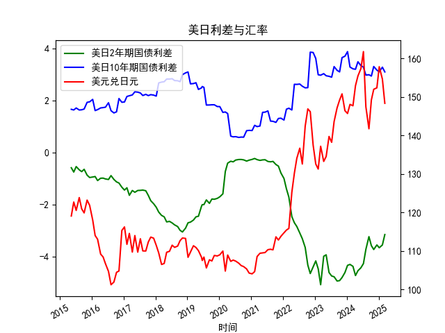

|            |   美元兑日元 |   美国10年期国债收益率 |   日本10年期国债收益率 |   美国2年期国债收益率 |   日本2年期国债收益率 |   每日美日2年期国债利差 |   每日美日10年期国债利差 |
|:-----------|-------------:|-----------------------:|-----------------------:|----------------------:|----------------------:|------------------------:|-------------------------:|
| 2023-08-09 |       143.58 |                  3.875 |                  0.572 |                 0.006 |                  4.79 |                   3.303 |                   -4.784 |
| 2023-09-12 |       147.12 |                  3.875 |                  0.716 |                 0.033 |                  4.98 |                   3.159 |                   -4.947 |
| 2023-10-11 |       149.17 |                  3.875 |                  0.776 |                 0.058 |                  4.99 |                   3.099 |                   -4.932 |
| 2023-11-08 |       150.77 |                  4.5   |                  0.852 |                 0.117 |                  4.93 |                   3.648 |                   -4.813 |
| 2023-12-11 |       146.41 |                  4.5   |                  0.798 |                 0.088 |                  4.71 |                   3.702 |                   -4.622 |
| 2024-01-10 |       145.68 |                  4.5   |                  0.621 |                 0.025 |                  4.37 |                   3.879 |                   -4.345 |
| 2024-02-07 |       148.04 |                  4     |                  0.714 |                 0.101 |                  4.41 |                   3.286 |                   -4.309 |
| 2024-03-12 |       147.69 |                  4     |                  0.783 |                 0.197 |                  4.58 |                   3.217 |                   -4.383 |
| 2024-04-10 |       152.9  |                  4     |                  0.801 |                 0.233 |                  4.97 |                   3.199 |                   -4.737 |
| 2024-05-08 |       155.42 |                  4.375 |                  0.887 |                 0.288 |                  4.84 |                   3.488 |                   -4.552 |
| 2024-06-11 |       157.32 |                  4.375 |                  1.035 |                 0.372 |                  4.81 |                   3.34  |                   -4.438 |
| 2024-07-10 |       161.73 |                  4.375 |                  1.093 |                 0.343 |                  4.62 |                   3.282 |                   -4.277 |
| 2024-08-07 |       147.42 |                  3.875 |                  0.899 |                 0.27  |                  4    |                   2.976 |                   -3.73  |
| 2024-09-11 |       141.72 |                  3.875 |                  0.886 |                 0.38  |                  3.62 |                   2.989 |                   -3.24  |
| 2024-10-09 |       149.2  |                  3.875 |                  0.936 |                 0.402 |                  3.99 |                   2.939 |                   -3.588 |
| 2024-11-05 |       151.96 |                  4.25  |                  0.944 |                 0.455 |                  4.19 |                   3.306 |                   -3.735 |
| 2024-12-11 |       152.34 |                  4.25  |                  1.083 |                 0.591 |                  4.15 |                   3.167 |                   -3.559 |
| 2025-01-07 |       157.82 |                  4.25  |                  1.148 |                 0.632 |                  4.3  |                   3.102 |                   -3.668 |
| 2025-02-12 |       154.62 |                  4.625 |                  1.346 |                 0.799 |                  4.36 |                   3.279 |                   -3.561 |
| 2025-03-12 |       148.32 |                  4.625 |                  1.527 |                 0.85  |                  4.01 |                   3.098 |                   -3.16  |

# 日元汇率与利差关系及投资机会分析

## 1. 日元汇率与利差背离现象的真实性判断

### 数据观察：
- **美日利差与汇率走势对比**：
  - **2年期利差**：从初始的-0.589%持续扩大至-5.09%（峰值），随后收窄至-3.16%（近期）。
  - **10年期利差**：整体呈现震荡上行趋势，从1.659%升至3.879%（峰值），近期回落至3.102%。
  - **美元兑日元汇率**：从119.09持续单边贬值至161.73（峰值），随后回调至148.32（近期）。

### 背离现象验证：
- **理论逻辑**：传统汇率理论认为，美债利差扩大（美国收益率更高）应驱动美元升值/日元贬值。但数据显示：
  - **短期（2年期）利差**与汇率相关性较强（利差扩大时日元加速贬值）。
  - **长期（10年期）利差**与汇率存在阶段性背离（例如2023年初10年期利差下行时，日元仍持续贬值）。
- **特殊背景**：
  - **日本企业利润结构**：约70%的东证指数成分股企业海外收入占比超40%，日元贬值直接提升以日元计价的海外收益。
  - **避险属性弱化**：在全球风险偏好回升阶段，日元避险需求下降，即使利差未显著扩大，汇率仍受资本外流压力驱动贬值。

### 结论：
文章观点**基本准确**。日元汇率与利差的阶段性背离主要源于：
- 日本企业的特殊盈利结构强化了汇率贬值对股市的利好；
- 日本央行超宽松政策削弱利差对汇率的传导效率；
- 全球资本流动中风险偏好变化的影响权重上升。

---

## 2. 近期投资/套利机会与策略

### 机会识别：
- **利差套利窗口**：
  - **现状**：美日2年期利差仍处-3.16%的历史高位，10年期利差维持在3%以上。
  - **策略**：借入日元（日本央行维持负利率）购买美债，锁定正利差收益。需对冲汇率风险（因日元已大幅贬值，进一步单边贬值空间有限）。
  
- **汇率均值回归交易**：
  - **现状**：美元兑日元从161.73高点回落至148.32，但仍在近30年高位。
  - **策略**：逢高做空美元/日元，目标区间140-145。触发条件包括：
    - 日本央行干预汇市（已多次发生）；
    - 美联储降息预期升温（利差收窄预期）。

- **日股多头配置**：
  - **逻辑**：日元贬值支撑企业盈利，东证指数EPS同比增速与美元/日元汇率呈正相关。
  - **标的**：优先选择海外收入占比高的出口企业（如汽车、电子、机械板块）。

### 风险提示：
- **政策风险**：日本央行可能突然调整YCC政策，导致日元快速升值；
- **流动性冲击**：全球地缘政治风险升温可能引发日元避险属性回归；
- **估值压力**：日股已部分反映汇率利好，需警惕盈利增速不及预期带来的回调。

---

**核心策略组合建议**：
1. **利差套利+汇率对冲**：做多美债/做空日债，同时买入美元兑日元看跌期权；
2. **日股结构性做多**：超配出口板块，利用期货对冲系统性风险；
3. **波动率交易**：押注日元汇率波动率放大（期权跨式组合），捕捉政策干预或利差反转行情。